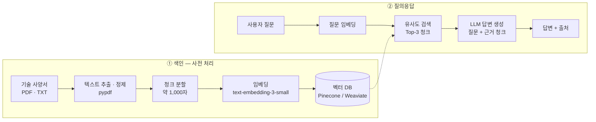

<p align="center">
  
</p>

<h1 align="center">WANNA KNOW</h1>

<p align="center">
  <b>수백 쪽짜리 기술 사양서, 이제 찾지 말고 물어보세요.</b><br>
  현대무벡스 기술 매뉴얼 기반 RAG Q&amp;A 서비스
</p>

<p align="center">
  
  
  
  
  
</p>

> **그런데 말입니다…**
> 그 부품의 작동 온도 범위, 사양서 몇 쪽에 적혀 있었을까~~~용?

<br>

## 📋 프로젝트 소개

**wanna_know**는 현대무벡스의 기술 사양서와 매뉴얼을 AI가 읽고, 엔지니어의 질문에 **근거 문서와 함께** 답하는 Q&A 서비스입니다.
SBS 〈그것이 알고싶다〉에서 콘셉트를 빌려, 사양서 속에 흩어진 단서를 찾아 답을 추적합니다.

| 항목 | 내용 |
| --- | --- |
| 과정 | 현대 AI 인사이트캠퍼스 · AI 서비스개발 과정 **5조** |
| 주제 | 기술 사양서 자동 해석 Q&A (🏢 현대무벡스 연계) |
| 기간 | 2026.10.21 ~ 11.02 (8일) |
| 키워드 | 문서 파싱 · 청크 전략 · 벡터 DB · RAG |

### 이런 질문에 답합니다

- "이 부품의 **규격**은?"
- "**작동 온도 범위**는 어떻게 되나요?"
- "**정기 점검 주기**와 점검 항목은?"

답변에는 근거가 된 사양서의 **출처(문서명·위치)** 가 함께 표시됩니다.

<br>

## ✨ 주요 기능 (MVP)

- [ ] 기술 사양서(PDF·TXT) 로드 및 텍스트 정제
- [ ] 청크 분할 → 임베딩 → 벡터 DB 저장
- [ ] 자연어 질문으로 관련 청크 검색 (Top-3)
- [ ] 검색된 근거 기반 답변 생성 + 출처 표시
- [ ] Gradio 웹 UI (예시 질문 포함)

<br>

## 🔍 동작 방식



응답 형식:

```json
{ "query": "작동 온도 범위는?", "answer": "...", "sources": ["..."] }
```

<br>

## 🛠 기술 스택

| 구분 | 기술 |
| --- | --- |
| 언어 | Python 3.9+ |
| LLM · 임베딩 | OpenAI API (`text-embedding-3-small`), 필요 시 Gemini |
| RAG 프레임워크 | LangChain |
| 벡터 DB | Pinecone 또는 Weaviate *(Day 3 확정)* |
| 문서 처리 | pypdf, pandas |
| 웹 UI | Gradio |
| 환경 · 협업 | python-dotenv, Git / GitHub |

<br>

## 📁 프로젝트 구조 (예정)

```
wanna_know/
├── assets/                 # 팀 로고
├── data/                   # 기술 사양서 원본 (공개 가능 여부 확인 후 커밋)
├── document_processor.py   # 문서 로드 · 청크 분할 · 임베딩 · 유사도 검색
├── main.py                 # RAG 파이프라인 (질문 → 검색 → 답변)
├── gradio_app.py           # 웹 UI
├── requirements.txt
├── .env.example            # 필요한 환경변수 안내
└── README.md
```

<br>

## 🚀 시작하기

> 개발 진행 중입니다. 아래 명령은 Day 7(10/30)에 실제 코드 기준으로 다시 검증합니다.

```bash
git clone https://github.com/Rose-Rosie-Rose/wanna_know.git
cd wanna_know

python -m venv .venv
source .venv/bin/activate          # Windows: .venv\Scripts\activate
pip install -r requirements.txt

cp .env.example .env               # OPENAI_API_KEY 등 입력 (.env는 커밋 금지)
python gradio_app.py               # → http://localhost:7860
```

<br>

## 📅 개발 일정

| Day | 날짜 | 단계 | 할 일 | 산출물 |
| :-: | --- | --- | --- | --- |
| 1 | 10/21 (수) | 기획 | 팀 구성 · 역할 분담 · 요구사항 및 MVP 정의 | 프로젝트 제안서 |
| 2 | 10/22 (목) | 환경 구축 | Python · API 키 · GitHub 세팅, RAG 개념 학습 | 환경 설정 가이드, 첫 API 호출 |
| 3 | 10/26 (월) | 백엔드 | 문서 전처리 · 청크 분할 · 임베딩 · 벡터 DB 구축 | `document_processor.py` |
| 4 | 10/27 (화) | 백엔드 | RAG 파이프라인, 에러 처리 · 로깅 | `main.py` |
| 5 | 10/28 (수) | 웹 UI | Gradio 화면 구성, 파이프라인 연결 | `gradio_app.py` |
| 6 | 10/29 (목) | 테스트 | E2E 테스트, 응답 시간 측정, 사용자 가이드 | 테스트 결과 보고서 |
| 7 | 10/30 (금) | 마무리 | 로컬 재현 테스트, README, 시연 영상 | 최종 README · 데모 영상 |
| 8 | 11/02 (월) | 발표 | 최종 발표, 기업 피드백 | 발표 자료 |

<br>

## 👥 팀원

<table>
  <tr>
    <td align="center"><a href="https://github.com/seram2002-wq"><br><b>박세람</b></a><br>팀장</td>
    <td align="center"><a href="https://github.com/Rose-Rosie-Rose"><br><b>강경원</b></a><br>Repo Owner</td>
    <td align="center"><a href="https://github.com/wintery7"><br><b>김민재</b></a><br>팀원</td>
    <td align="center"><a href="https://github.com/clipnpaper"><br><b>김현준</b></a><br>팀원</td>
    <td align="center"><a href="https://github.com/daui1727"><br><b>이정빈</b></a><br>팀원</td>
    <td align="center"><a href="https://github.com/Y1OO5B"><br><b>조윤빈</b></a><br>팀원</td>
  </tr>
</table>

> 세부 역할은 Day 1(10/21)에 확정한 뒤 업데이트합니다.

<br>

## 🎨 팀 로고

SBS 〈그것이 알고싶다〉 타이틀에서 모티브를 얻었습니다.
노란 역삼각형 위에서 턱을 괸 캐릭터가 사양서 속 답을 궁금해하는 모습으로, **"기술사양서가 알고싶다"** 를 외칩니다.

- 원본: [`assets/logo.png`](assets/logo.png) (1254×1254, 프로필 · 발표 자료용)

<br>

---

<p align="center">
  <sub>🎓 HYUNDAI AI Insight Campus · AI 서비스개발 과정 5조<br>
  본 프로젝트는 교육 목적의 팀 프로젝트이며, SBS 및 〈그것이 알고싶다〉와 무관합니다.</sub>
</p>
